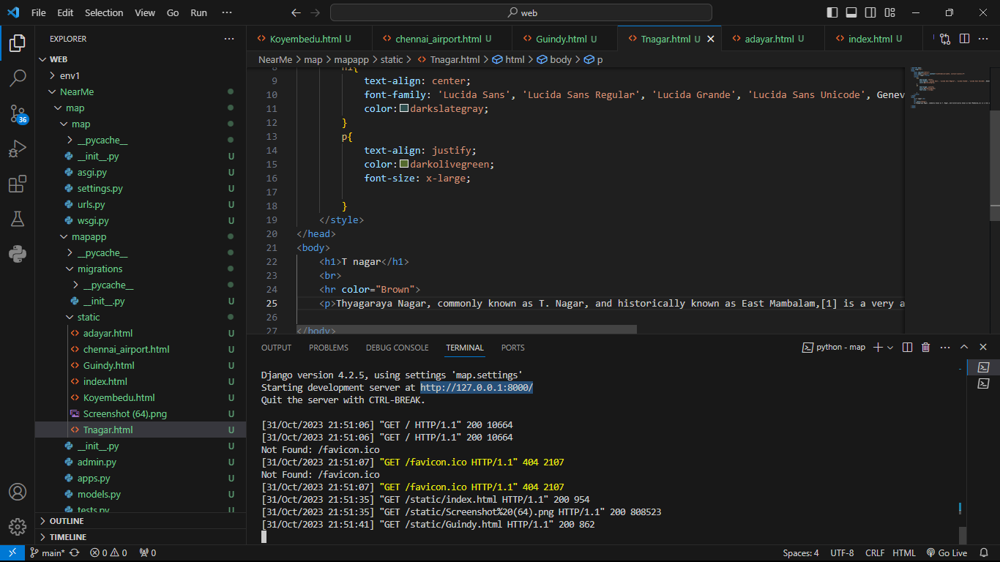
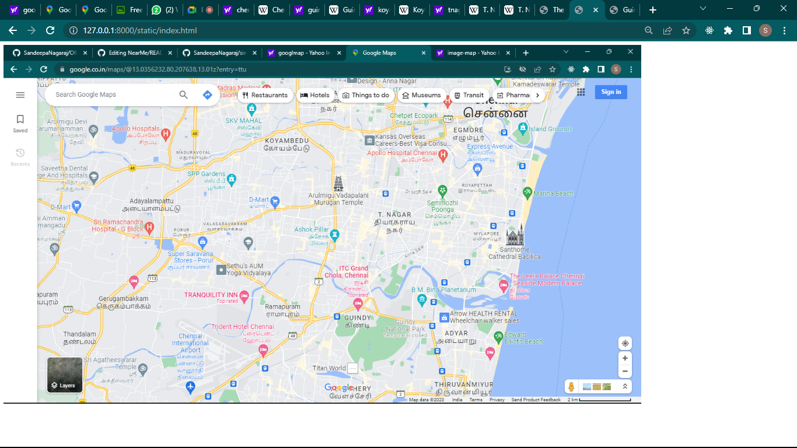
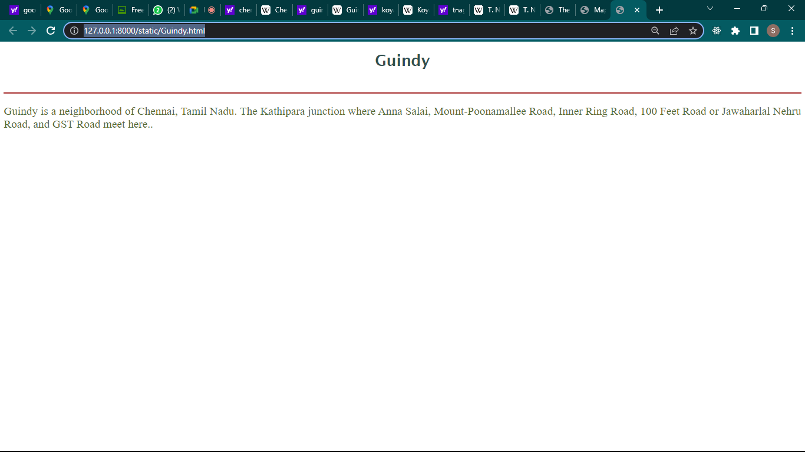
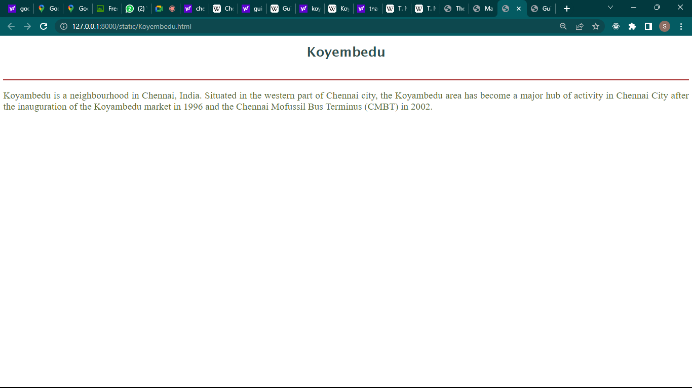
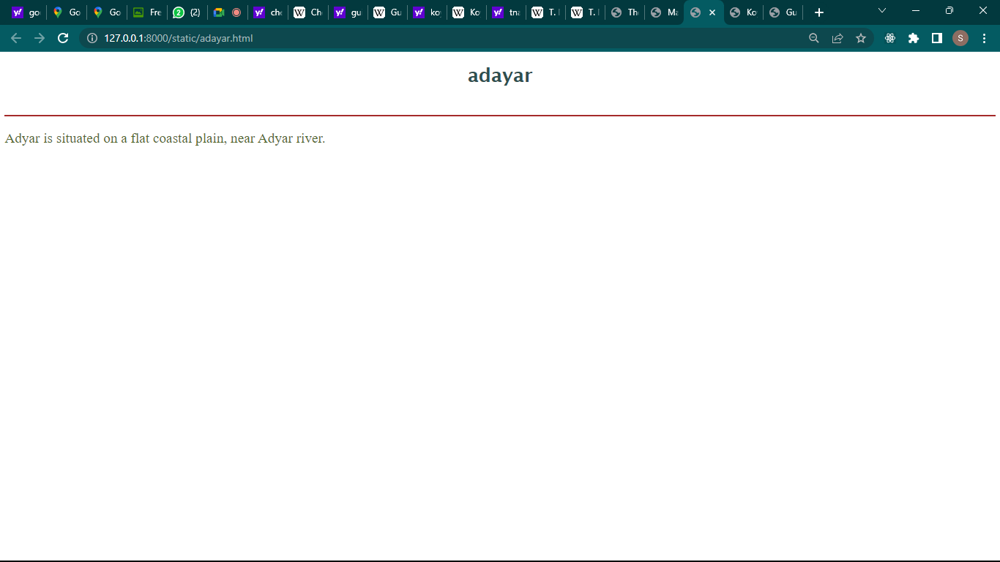
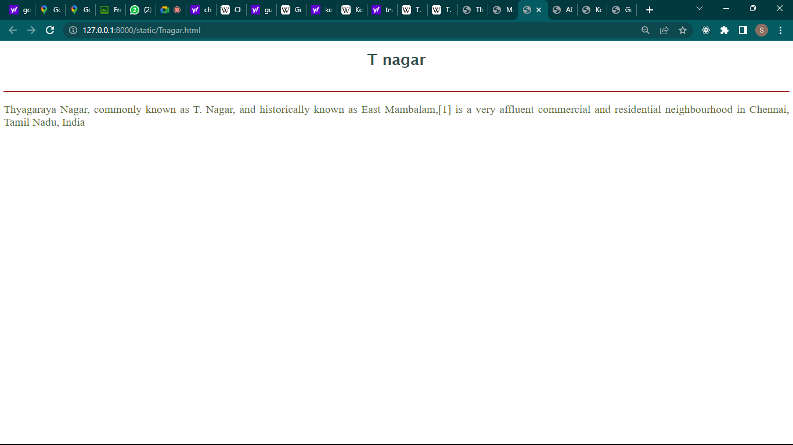
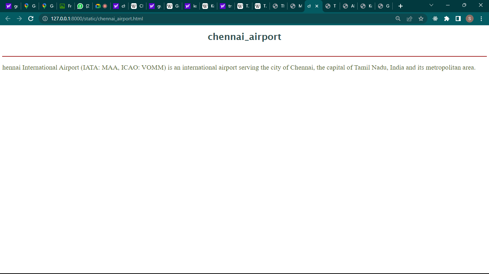

# Ex04 Places Around Me
## DATE : 28/10/2023
## AIM
To develop a website to display details about the places around my house.

## DESIGN STEPS

### STEP 1
Create a Django admin interface.

### STEP 2
Download your city map from Google.

### STEP 3
Using ```<map>``` tag name the map.

### STEP 4
Create clickable regions in the image using ```<area>``` tag.

### STEP 5
Write HTML programs for all the regions identified.

### STEP 6
Execute the programs and publish them.

## CODE
## index.html
```html
<!DOCTYPE html>
<html lang="en">
<head>
    <meta charset="UTF-8">
    <meta name="viewport" content="width=device-width, initial-scale=1.0">
    <title>Map</title>
</head>
<body>
    <!-- Image Map Generated by http://www.image-map.net/ -->


<map name="image-map">
    <area target="_blank" alt="koyembedu" title="koyembedu" href="Koyembedu.html" coords="667,243,561,203" shape="rect">
    <area target="_blank" alt="chennai airport" title="chennai airport" href="chennai_airport.html" coords="361,615,437,712" shape="rect">
    <area target="_blank" alt="Guindy" title="Guindy" href="Guindy.html" coords="719,568,787,605" shape="rect">
    <area target="_blank" alt="TNagar" title="TNagar" href="Tnagar.html" coords="793,351,874,407" shape="rect">
    <area target="_blank" alt="adyar" title="adyar" href="adayar.html" coords="929,611,1007,639" shape="rect">
</map>
</body>
</html>
```
<br>

## adayar.html
```html
<!DOCTYPE html>
<html lang="en">
<head>
    <meta charset="UTF-8">
    <meta name="viewport" content="width=device-width, initial-scale=1.0">
    <title>ADAYAR</title>
    <style>
        h1{
            text-align: center;
            font-family: 'Lucida Sans', 'Lucida Sans Regular', 'Lucida Grande', 'Lucida Sans Unicode', Geneva, Verdana, sans-serif;
            color:darkslategray;
        }
        p{
            text-align: justify;
            color:darkolivegreen;
            font-size: x-large;
            
        }
    </style>
</head>
<body>
    <h1>adayar</h1>
    <br>
    <hr color="Brown">
    <p>Adyar is situated on a flat coastal plain, near Adyar river.</p>

</body>
</html>
```
<br>

## chennai_airport.html
```html
<!DOCTYPE html>
<html lang="en">
<head>
    <meta charset="UTF-8">
    <meta name="viewport" content="width=device-width, initial-scale=1.0">
    <title>chennai_airport</title>
    <style>
        h1{
            text-align: center;
            font-family: 'Lucida Sans', 'Lucida Sans Regular', 'Lucida Grande', 'Lucida Sans Unicode', Geneva, Verdana, sans-serif;
            color:darkslategray;
        }
        p{
            text-align: justify;
            color:darkolivegreen;
            font-size: x-large;
            
        }
    </style>
</head>
<body>
    <h1>chennai_airport</h1>
    <br>
    <hr color="Brown">
    <p>.</p>

</body>
</html>
```
<br>

## Guindy.html
```html
<!DOCTYPE html>
<html lang="en">
<head>
    <meta charset="UTF-8">
    <meta name="viewport" content="width=device-width, initial-scale=1.0">
    <title>Guindy</title>
    <style>
        h1{
            text-align: center;
            font-family: 'Lucida Sans', 'Lucida Sans Regular', 'Lucida Grande', 'Lucida Sans Unicode', Geneva, Verdana, sans-serif;
            color:darkslategray;
        }
        p{
            text-align: justify;
            color:darkolivegreen;
            font-size: x-large;
            
        }
    </style>
</head>
<body>
    <h1>Guindy</h1>
    <br>
    <hr color="Brown">
    <p>Guindy is a neighborhood of Chennai, Tamil Nadu. The Kathipara junction where Anna Salai, Mount-Poonamallee Road, Inner Ring Road, 100 Feet Road or Jawaharlal Nehru Road, and GST Road meet here..</p>

</body>
</html>
```
<br>

## Koyembedu.html
```html
<!DOCTYPE html>
<html lang="en">
<head>
    <meta charset="UTF-8">
    <meta name="viewport" content="width=device-width, initial-scale=1.0">
    <title>Koyembedu</title>
    <style>
        h1{
            text-align: center;
            font-family: 'Lucida Sans', 'Lucida Sans Regular', 'Lucida Grande', 'Lucida Sans Unicode', Geneva, Verdana, sans-serif;
            color:darkslategray;
        }
        p{
            text-align: justify;
            color:darkolivegreen;
            font-size: x-large;
            
        }
    </style>
</head>
<body>
    <h1>Koyembedu</h1>
    <br>
    <hr color="Brown">
    <p>Koyambedu is a neighbourhood in Chennai, India. Situated in the western part of Chennai city, the Koyambedu area has become a major hub of activity in Chennai City after the inauguration of the Koyambedu market in 1996 and the Chennai Mofussil Bus Terminus (CMBT) in 2002.</p>

</body>
</html>
```
<br>

## Tnagar.html
```html
<!DOCTYPE html>
<html lang="en">
<head>
    <meta charset="UTF-8">
    <meta name="viewport" content="width=device-width, initial-scale=1.0">
    <title>T nagar</title>
    <style>
        h1{
            text-align: center;
            font-family: 'Lucida Sans', 'Lucida Sans Regular', 'Lucida Grande', 'Lucida Sans Unicode', Geneva, Verdana, sans-serif;
            color:darkslategray;
        }
        p{
            text-align: justify;
            color:darkolivegreen;
            font-size: x-large;
            
        }
    </style>
</head>
<body>
    <h1>T nagar</h1>
    <br>
    <hr color="Brown">
    <p>Thyagaraya Nagar, commonly known as T. Nagar, and historically known as East Mambalam,[1] is a very affluent commercial and residential neighbourhood in Chennai, Tamil Nadu, India</p>

</body>
</html>
```


## OUTPUT









## RESULT
The program for implementing image maps using HTML is executed successfully.
